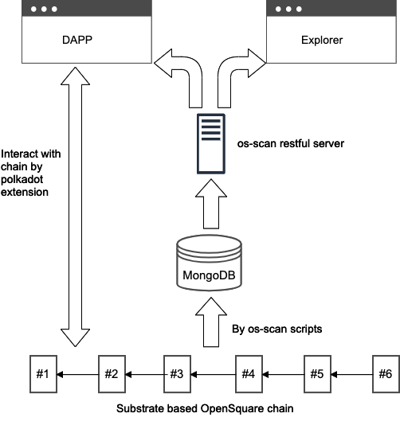

## Code repositories

There are 2 repositories to serve the fronted part of whole OpenSquare business.

- [Dapps](https://github.com/opensquare-network/dapps) includes 2 parts:
  - code of front pages written with react and redux
  - a content server which serve the bounty detail content
- [os-scan](https://github.com/opensquare-network/os-scan) includes 3 parts:
  - scan scripts which track the blocks, extract the business and save the corresponding data to MongoDB.
  - server which serve the restful APIs for explorer and dapps front pages.
  - site which is the code for explorer pages written with react and redux.


## Logical architecture

Generally we can see the logical parts in following charts and how their works with each other.

- Substrate based OpenSquare chain which produce blocks.
- Scan scripts which scan blocks and save business data to MongoDB.
- Scan server which provide restful apis to Dapp and explorer.
- Dapp which interact with the OpenSquare chain.
- Explorer which help view the blocks, extrinsics, events and other business data.




## Content server apis

#### Post bounty detail to content server

```
POST https://content.opensquare.network/content
```

params:
- description: the bounty detail
- hash: blake2 hash of the detail


#### Get bounty detail by hash

```
GET https://content.opensquare.network/content/:hash
```

params:
- hash: blake2 hash of the detail

## OS-Scan server apis

### Accounts apis

#### List accounts

```
GET https://api.opensquare.network/accounts
```

queries:
- page: the page index
- page_size: number of row per page

#### Get account detail information

```
GET https://api.opensquare.network/accounts/:address
```

params:
- address: ss58format address of the account

#### List extrinsics that are related to account

```
GET https://api.opensquare.network/accounts/:address/extrinsics
```

params:
- address: ss58format address of the account

queries:
- page: the page index
- page_size: number of row per page

#### List account's funded bounties

```
GET https://api.opensquare.network/accounts/:address/fundbounties
```

params:
- address: ss58format address of the account

queries:
- page: the page index
- page_size: number of row per page


#### List account's hunted bounties

```
GET https://api.opensquare.network/accounts/:address/huntbounties
```

params:
- address: ss58format address of the account

queries:
- page: the page index
- page_size: number of row per page


#### List bounties that the account is applying as hunter

```
GET https://api.opensquare.network/accounts/:address/applyingbounties
```

params:
- address: ss58format address of the account

queries:
- page: the page index
- page_size: number of row per page


#### List bounties that are assigned to the account

```
GET https://api.opensquare.network/accounts/:address/assignedbounties
```

params:
- address: ss58format address of the account

queries:
- page: the page index
- page_size: number of row per page


#### List account's extrinsics

```
GET https://api.opensquare.network/accounts/:address/behaviors
```

params:
- address: ss58format address of the account

queries:
- page: the page index
- page_size: number of row per page


#### List pending approved bounties created by the account

```
GET https://api.opensquare.network/accounts/:address/pendingapprove
```

params:
- address: ss58format address of the account

queries:
- page: the page index
- page_size: number of row per page


#### List the approved/rejected bounties created by by the account

```
GET https://api.opensquare.network/accounts/:address/examinedbounties
```

params:
- address: ss58format address of the account

queries:
- page: the page index
- page_size: number of row per page


#### Count the number of bounties hunting by the account

```
GET https://api.opensquare.network/accounts/:address/applyingbountiescount
```

params:
- address: ss58format address of the account

queries:
- page: the page index
- page_size: number of row per page


#### Count the number of bounties assigned to the account

```
GET https://api.opensquare.network/accounts/:address/assignedbountiescount
```

params:
- address: ss58format address of the account

queries:
- page: the page index
- page_size: number of row per page


#### Count the number of extrinsics sent by the account

```
GET https://api.opensquare.network/accounts/:address/behaviorscount
```

params:
- address: ss58format address of the account

queries:
- page: the page index
- page_size: number of row per page


#### Count the number of pendding approved bunties created by the account

```
GET https://api.opensquare.network/accounts/:address/pendingapprovecount
```

params:
- address: ss58format address of the account

queries:
- page: the page index
- page_size: number of row per page


#### Count the number of approved/rejected bunties created by the account

```
GET https://api.opensquare.network/accounts/:address/examinedbountiescount
```

params:
- address: ss58format address of the account

queries:
- page: the page index
- page_size: number of row per page

### Block apis

#### List blocks

```
GET https://api.opensquare.network/blocks
```

queries:
- page: the page index
- page_size: number of row per page

#### Get block detail

```
GET https://api.opensquare.network/blocks/:heightOrHashOrId
```

params:
- heightOrHashOrId: block height or block hash or mongo id

queries:
- page: the page index
- page_size: number of row per page

#### List block extrinsics

```
GET https://api.opensquare.network/blocks/:heightOrHashOrId/extrinsics
```

params:
- heightOrHashOrId: block height or block hash or mongo id

#### List block events

```
GET https://api.opensquare.network/blocks/:heightOrHashOrId/events
```

params:
- heightOrHashOrId: block height or block hash or mongo id


### Event apis

#### List events

```
GET https://api.opensquare.network/events
```

queries:
- page: the page index
- page_size: number of row per page


#### Get event detail

```
GET https://api.opensquare.network/events/:id
```

params:
- id: event hash / [block height]-[event index] / mongo id


### Extrinsic apis

#### List extrinsics

```
GET https://api.opensquare.network/extrinsics
```

queries:
- page: the page index
- page_size: number of row per page


#### Get extrinsic detail

```
GET https://api.opensquare.network/extrinsics/:id
```

params:
- id: extrinsic hash / [block height]-[extrinsic index] / mongo id


### Bounty apis

#### List bounties

```
GET https://api.opensquare.network/bounties
```

queries:
- page: the page index
- page_size: number of row per page

#### List bounties that can be applied by hunters

```
GET https://api.opensquare.network/bounties/huntable
```

queries:
- page: the page index
- page_size: number of row per page

#### Get bounty detail

```
GET https://api.opensquare.network/bounties/:bountyId
```

params:
- bountyId: unique id of the bounty


#### Get bounty hunters

```
GET https://api.opensquare.network/bounties/:bountyId/hunters
```

params:
- bountyId: unique id of the bounty

### Councilor apis


#### List pendding approved bounties

```
GET https://api.opensquare.network/councilor/pendingapprove
```

queries:
- page: the page index
- page_size: number of row per page

