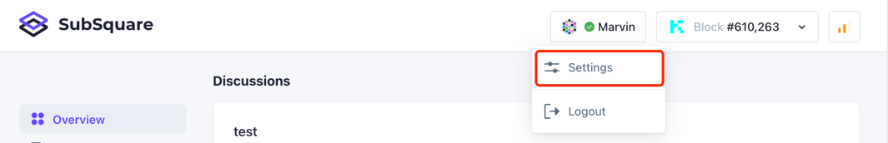
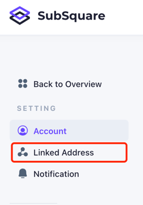
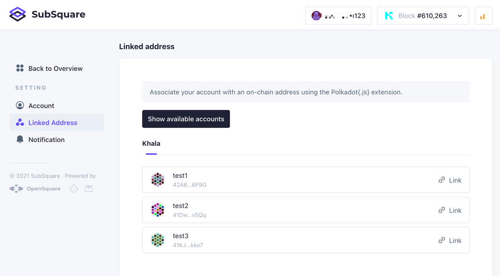
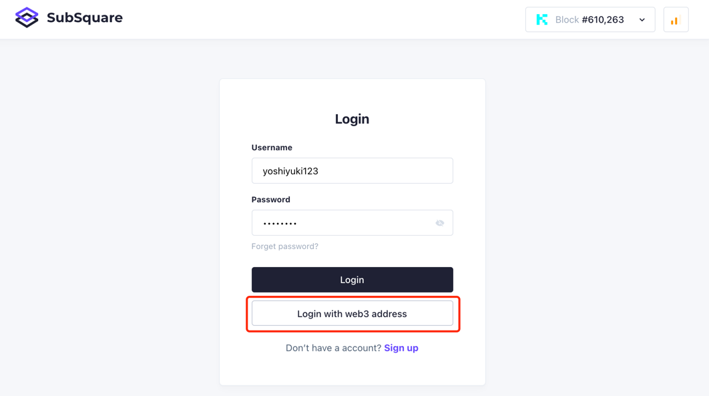
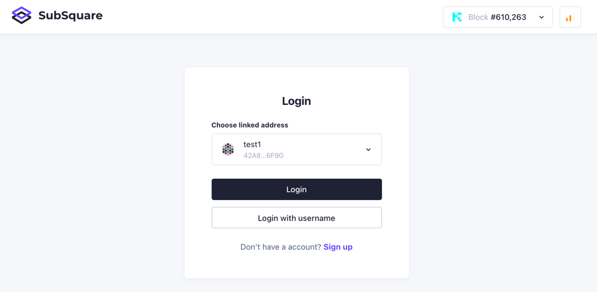

## A web3 style way to login
Aside traditional username&password authorization, users may link a `Polkadot-js` account with SubSquare account and login with signing by `Polkadot-js`.

## How to link
[Create a SubSquare account](/registration) and login first.
Click on username section on the top right portion of SubSquare main website and find settings.

Then find a 'Linked Address' menu option.  
  
By default, there is maybe no addresses available to choose, click 'Show available accounts' button if so.  
  
Choose an address to bind with the SubSquare account and sign with `Polkadot-js` extension for it.

## Try login without username&password  
Find the on login page.  

The page will redirect to a selection, choose the address linked to the SubSquare account, and again, sign for it with `Polkadot-js` extension.  

## Troubleshooting
Check if [Polkadot-js extension](https://polkadot.js.org/extension/) is installed properly, also, using the latest Chrome is recommended.  
