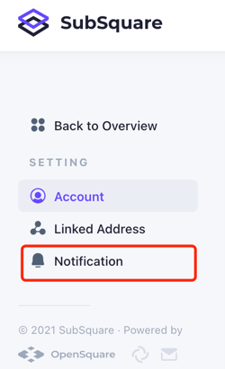
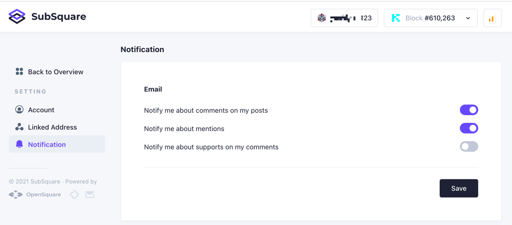

## Notification settings
Notification subscription is available to all registered&email verified users.  
To manage what to send and not to send, click on username section on the top right portion of SubSquare main website and find settings.  

Then go to 'Notification' section.  
  
There are three kinds of notifications :  
* New comments on a post  
* Mentioned in a post or a comment(AKA @someone)
* New supporter to a post   

Users may toggle these options to get real important notifications, and all notifications will be sent via Email.  
