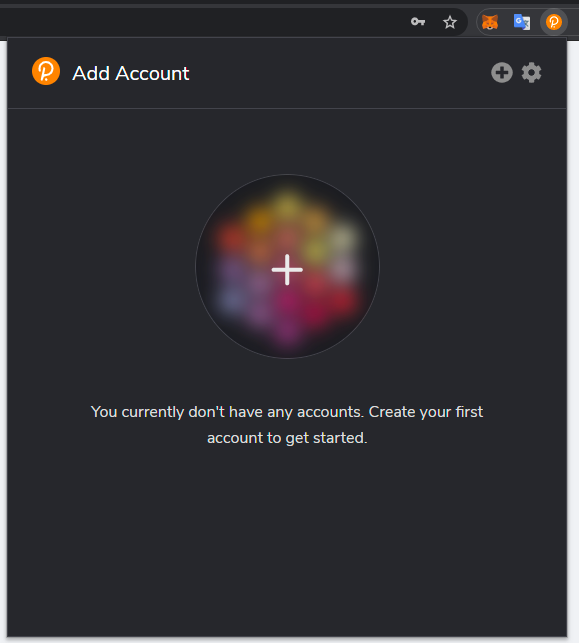

This chapter, we will guide you through a complete process of a Vote flow. We assume that the reader already know how to use [Polkadot Extension](https://chrome.google.com/webstore/detail/polkadot%7Bjs%7D-extension/mopnmbcafieddcagagdcbnhejhlodfdd), this tutorial will use it to manage our accounts. If you don't have it, please install and learn about it before starting.

## Get Polkadot{.js} extension
This browser extension manages accounts and allows the signing of transactions with those accounts. 

## Create Account
(Skip if you already have accounts).Open the Polkadot{.js} browser extension by clicking the logo on the top bar of your browser. You will see a browser popup, not unlike the one below.
  
Click the big plus button or select "Create new account" from the small plus icon in the top right. The Polkadot{.js} plugin will then use system randomness to make a new seed for you and display it to you in the form of twelve words.  
  
You should back up these words as explained above. It is imperative to store the seed somewhere safe, secret, and secure.
The next, you will be asked to set a name and a password for it.Then complete the account creation.

## You are ready  
Now, the preparatory work has been completed. You can start the journey.

## Mark
Like any other websites, we also support username&password authorization, you may still access to most of our features without a polkadot.js extension.    
