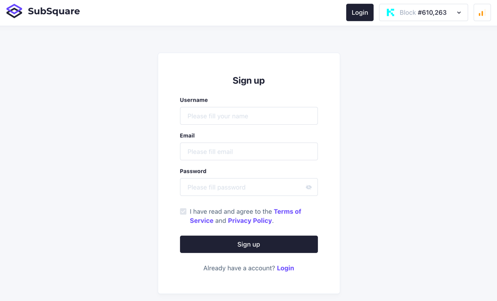

## Services available to Users
| Available Services           | Visitor | Web Users |
|------------------------------|---------|-----------|
| Browse the site              | ✓       | ✓         |
| Create new discussions       | -       | ✓         |
| Get notification for replies | -       | ✓         |

## Register with SubSquare
Click on ''Login'' on the top right portion of SubSquare main website.
  
You can find a login page.
Before the first login, go to sign-up page first.  
Input the information.
  
After the submission, a new account is created. Additional, check the link which will be sent to the email address, get the account verified and ready to discussion. 
